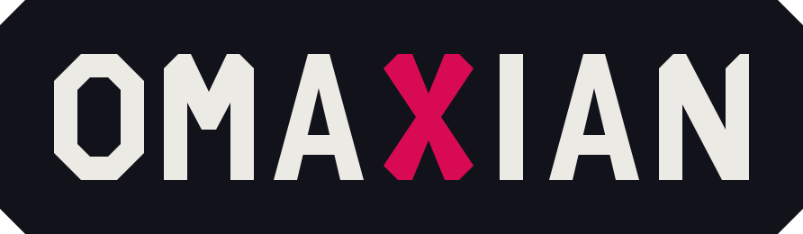
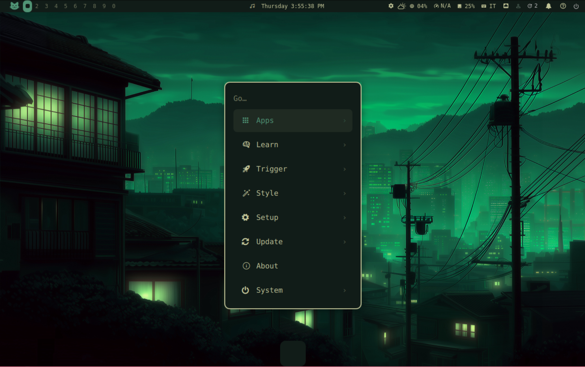
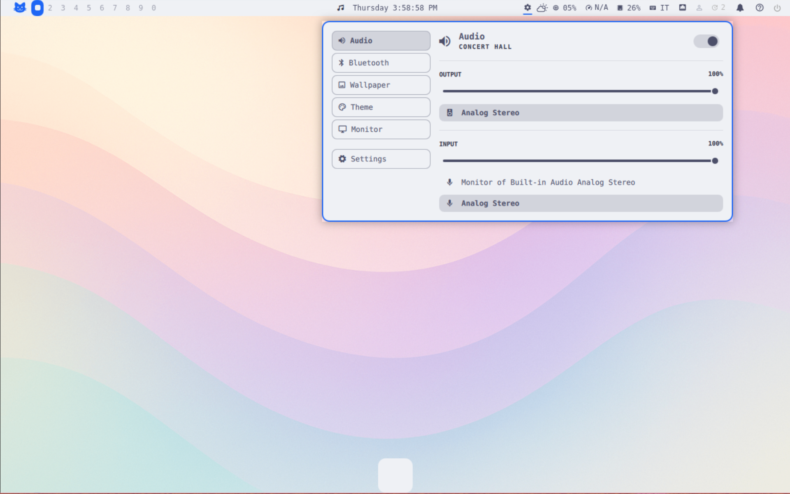
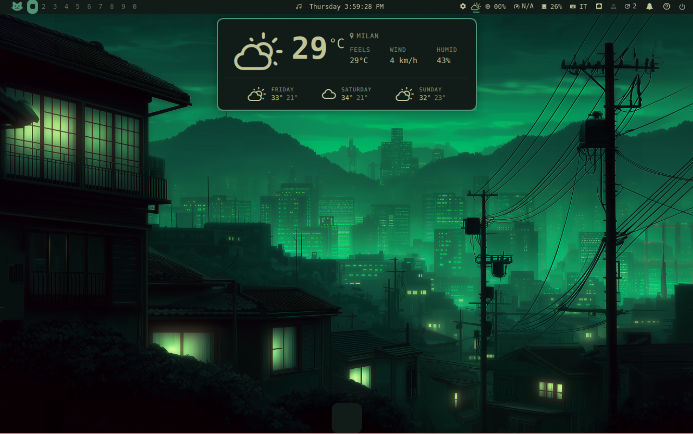
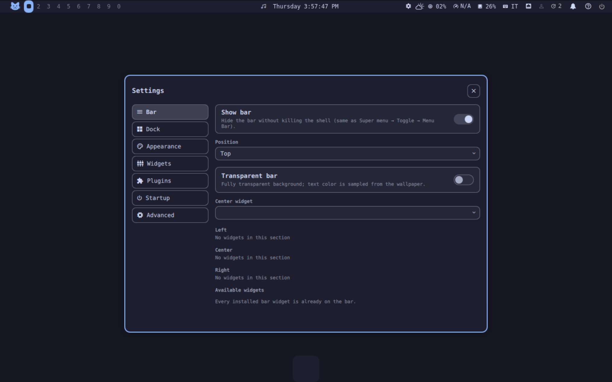
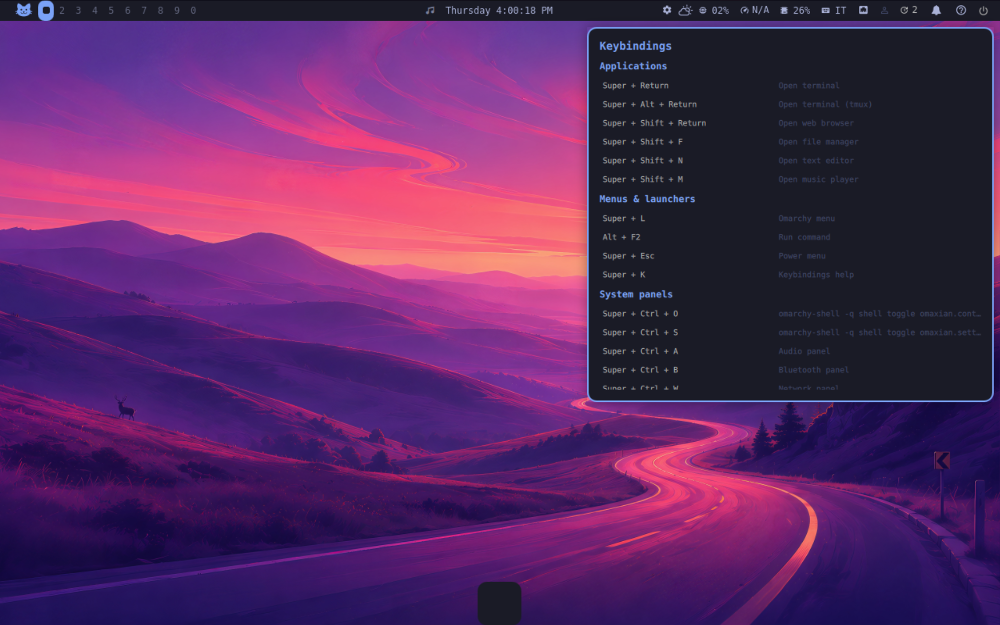
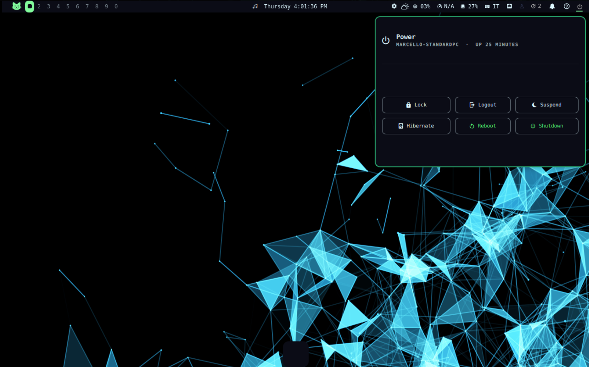

<p align="center">
  
</p>

# Omaxian

Omaxian is [Omarchy](https://omarchy.org) for **Devuan / Debian + X11/XLibre + i3**.
Same bar, themes, launcher, and `omarchy-*` commands — no Wayland, Hyprland, and no dependency on systemd or other init systems.

You get a top bar (workspaces, clock, media, network, weather, tray, …),
popups for audio / bluetooth / Wi-Fi / power, a live theme switcher, a settings editor, an
Omarchy menu (apps + commands), and a command runner. Notifications use
**dunst**; the compositor is **picom**.

Porting notes and file-by-file diffs live in [`docs/omarchy-port/`](docs/omarchy-port/).

## Gallery

<table>
  <tr>
    <td align="center" width="33%"><br/><sub>Menu</sub></td>
    <td align="center" width="33%"><br/><sub>Control Panel</sub></td>
    <td align="center" width="33%"><br/><sub>Weather</sub></td>
  </tr>
  <tr>
    <td align="center" width="33%"><br/><sub>Settings</sub></td>
    <td align="center" width="33%"><br/><sub>Key bindings</sub></td>
    <td align="center" width="33%"><br/><sub>Power menu</sub></td>
  </tr>
</table>

---

## What Omaxian adds (Omarchy does not ship these)

Omaxian is not only a backend swap. Several first-party pieces have **no
upstream counterpart** — they exist because X11/i3/Debian needed them, or
because a GUI was missing.

| Piece                                                     | What you get                                                                                                                                                                                                                         |
| --------------------------------------------------------- | ------------------------------------------------------------------------------------------------------------------------------------------------------------------------------------------------------------------------------------ |
| **Control Panel** (`Super+Ctrl+O`)                        | One gear on the bar: audio, Bluetooth, wallpaper, theme, and monitors in a single tabbed popup. Omarchy keeps those as separate widgets (the separate widgets are still available).                                                  |
| **Settings** (`Super+Ctrl+S`, or Menu → Setup → Settings) | A window to edit bar layout/position, dock chrome, widget options, plugin on/off, font/spacing, extra wallpaper folder, and **startup apps**. Omarchy edits the bar by drag gestures (not ported here) and has no equivalent editor. |
| **Dock**                                                  | A persistent bottom dock (pinned apps, running-app dots, hover magnification). First-party here; upstream’s dock is a separate community plugin.                                                                                     |
| **Display profiles** (`Super+Ctrl+D`)                     | xrandr resolution / on / off / primary / position, with saved layouts per output topology and laptop-lid handling. Omarchy’s monitor panel is brightness + fractional scale (Hyprland), not this.                                    |
| **SysStats, VPN, apt updates**                            | CPU / GPU / RAM on the bar; a VPN indicator; an apt-upgradable count. None of those are Omarchy bar widgets (upstream updates are Arch `checkupdates`).                                                                              |
| **Media widget**                                          | MPD shows up next to other MPRIS players via `mpDris2`.                                                                                                                                                                              |
| **Help on the bar**                                       | Super+K / the `?` widget — a cheat-sheet of this session’s i3 binds.                                                                                                                                                                 |
| **`omarchy-plugin-check`**                                | Static check of a community plugin against this X11 port (Wayland/Hyprland/PipeWire/systemd couplings). Upstream only has schema validation.                                                                                         |
| **Debian / Devuan session**                               | elogind (`loginctl`) instead of systemd; PulseAudio *or* PipeWire; `apt` instead of pacman; no `uwsm`. Reminders use `sleep`, not systemd timers; night light is **redshift**, not hyprsunset.                                       |

The shared Omarchy surface is still there: themes, the command menu, weather,
clock/calendar, tray, OSD, Wi-Fi QR, speed tests, and the `omarchy-*` CLI.

---

## Install

You need an X11 session with **i3** and a display manager that runs
`/etc/X11/Xsession` (**lightdm** does). Then, from this repo:

```sh
git clone <this-repo> ~/projects/omaxian
cd ~/projects/omaxian

sudo ./setup.sh          # packages, fonts, session D-Bus
./install.sh             # themes + omarchy-* commands
./deploy.sh              # i3 / Quickshell / ~/.xsessionrc
```

`setup.sh` is safe to re-run. Useful flags: `--minimal`, `--optional`,
`--deploy` (runs `install.sh` + `deploy.sh` for you after packages).

**Then log out and back in** (not `i3 restart`) so i3 picks up `PATH`.
Pick the i3 / Omaxian session in the greeter.

### Quickshell

The bar needs [Quickshell](https://quickshell.org) ≥ 0.2 (0.3.x tested).
Debian 13+ can `apt install quickshell`. 
On **Debian &lt; 13 / Devuan** it is not in apt — `setup.sh` warns and skips it. 
You can build it from source <https://quickshell.org/docs/guide/install/> or install it from the `testing` repository (see below).

### After install

```sh
omarchy-shell shell ping                 # → ok
omarchy-shell shell listPlugins | jq length   # → ~37
pgrep -x quickshell                      # one process
```

Re-run `./deploy.sh` after `git pull`. It overwrites configs from this repo
but does not delete files you (or an older deploy) left behind.

---

## Daily use

**Super** is the Windows key. Press **Super+K** for the full cheat-sheet.

| Key                         | Action                              |
| --------------------------- | ----------------------------------- |
| Super+Return                | terminal                            |
| Super+Space / Alt+F2        | Omarchy menu / run a command        |
| Super+Esc                   | power menu                          |
| Super+K                     | keybinding help                     |
| Alt+Ctrl+T                  | theme picker                        |
| Super+Ctrl+A / B / W / P    | audio / bluetooth / network / power |
| Super+Ctrl+O / Super+Ctrl+S | Control Panel / Settings            |
| Super+Ctrl+D                | display settings                    |
| Super+Ctrl+C / Super+Ctrl+L | screenshot / lock                   |
| Super+1…0                   | workspaces                          |

Themes:

```sh
omarchy-theme-list
omarchy-theme-set "Tokyo Night"
omarchy-theme-next
```

That restyles the bar, i3, dunst, GTK icons, kitty, and the wallpaper.
Click bar widgets for their panels; the clock opens a calendar.

Bar layout, dock, plugins, appearance, and extra startup apps are edited from
**Settings** (`Super+Ctrl+S`). The same data still lives in
`~/.config/omarchy/shell.json` (and friends) if you prefer a text editor.
Restart the shell after QML or theme-file edits:

```sh
omarchy-restart-shell
```

The left menu glyph (default: Archcraft cat) is a widget setting — change it
in Settings → Widgets, or as a layout `settings` entry. The character must
exist in the bar font, or set `iconFont` to a family that has it:

```json
{ "id": "omaxian.menu", "settings": { "icon": "󰣇" } }
```

---

## Where it is not 1:1 with Omarchy

Omaxian is the same shell on X11/i3, not a Hyprland session. Things that
work differently or are missing:

- **Click-outside does not always close a popup.** A widget anchored to the bar
  may stay open if you click into another window. Close it with Escape, the
  same widget, or the same keybind.
- **No idle / lid auto-lock.** Lock is Super+Ctrl+L only. Omarchy's screensaver
  and session-lock plugins are not ported.
- **No dimming overlay.** Full-screen Omarchy scrims (lock, some pickers) would
  go black under picom; panels are small popups instead. Escape dismisses them.
- **Bar cannot be dragged** to another screen or reordered by dragging widgets.
  Use Settings → Bar, or edit `~/.config/omarchy/shell.json`.
- **Display panel is layout only** (resolution, on/off, position). Omarchy's
  brightness / fractional-scale panel is not ported; use the brightness keys.
- **Audio panel has no input VU meter**; per-app rows show the raw app name.
- **No Omarchy clipboard, emoji picker, image carousel, agents, or built-in
  notification daemon.** Notifications stay on **dunst**. Theme picking is a
  thumbnail grid, not the vips carousel. The Omarchy menu (`Super+Space`) skips
  Arch Install/Remove trees and Hyprland-only actions.
- **No screen recording or dictation** indicators.
- **`i3 restart` is not a full reload.** Log out and back in after the first
  deploy, or run `omarchy-restart-shell`.

The full skip list is in [`docs/omarchy-port/deltas.md`](docs/omarchy-port/deltas.md).

---

## Requirements in short

`setup.sh` installs these. The important ones:

- **Must have:** i3, Quickshell, picom, dunst, kitty, NetworkManager, PulseAudio
  (or pipewire-pulse), a polkit agent (`mate-polkit`), lightdm, and the bundled
  fonts (otherwise the bar shows tofu).
- **`python3-xlib`:** without it, typing in the Omarchy menu does nothing.
- **No systemd needed.** Session pieces are elogind (`loginctl`) and D-Bus.
  `setup.sh` turns on `use-session-dbus` in `/etc/X11/Xsession.options`.

---

## Debian 13 and Devuan Excalibur

In Debian 13 and Devuan Excalibur quickshell is available only in the testing repository.
Instead of manually build it you can add the testing repository using apt pinning without compromising the system in this way:

### Debian 13

1. Add the Forky repo

Trixie uses deb822 format by default (your main sources live in /etc/apt/sources.list.d/debian.sources), so create:

/etc/apt/sources.list.d/forky.sources

```
Types: deb
URIs: http://deb.debian.org/debian
Suites: forky
Components: main contrib non-free non-free-firmware
Signed-By: /usr/share/keyrings/debian-archive-keyring.gpg
```

Leave your existing trixie / trixie-security / trixie-updates entries untouched.

2. Pin Forky below stable

/etc/apt/preferences.d/forky
```
Package: *
Pin: release n=trixie-security
Pin-Priority: 990

Package: *
Pin: release n=trixie
Pin-Priority: 900

Package: *
Pin: release n=forky
Pin-Priority: 100
```

900 keeps stable as the default for everything, 100 makes testing installable only on explicit request while still allowing upgrades of packages you've already taken from it.

3. Install from testing on demand

```
sudo apt update
sudo apt install -t forky quickshell qml6-module-qt-labs-folderlistmodel qml6-module-qtquick-effects
```

Or per-package: `apt install <package>/forky`

4. Verify

apt policy

Trixie should show priority 900, Forky 100.

Same caveats apply: -t forky may pull in testing versions of dependencies (watch out when it wants to upgrade libc6, gcc runtime libs, or similar core packages — that can cascade), and Debian's security team doesn't cover testing the same way as stable, so packages from Forky rely on fixes migrating from unstable rather than DSAs. If a Forky package drags in too many dependencies, a backport from trixie-backports (if available) is often the safer alternative.


### Devuan Excalibur

**1. Add the Freia repo** (deb822 format, since Excalibur ships APT 3): `/etc/apt/sources.list.d/freia.sources`
```
Types: deb
URIs: http://deb.devuan.org/merged
Suites: freia
Components: main contrib non-free non-free-firmware
Signed-By: /usr/share/keyrings/devuan-archive-keyring.gpg
```

Leave your existing `excalibur` / `excalibur-security` / `excalibur-updates` entries as they are.

**2. Pin Freia below stable**
`/etc/apt/preferences.d/freia`
```
Package: *
Pin: release n=excalibur-security
Pin-Priority: 990

Package: *
Pin: release n=excalibur
Pin-Priority: 900

Package: *
Pin: release n=freia
Pin-Priority: 100
```

Priority 100 means Freia packages are never chosen automatically (stable at 900 always wins), but they're available if you ask for them explicitly. Anything you already pulled from Freia will still get upgraded from Freia later, since 100 is still above the "never install" threshold.

**3. Install from testing**

```
sudo apt update
sudo apt install -t freia quickshell qml6-module-qt-labs-folderlistmodel qml6-module-qtquick-effects
```

Or for a one-off: `apt install <package>/freia`.

**4. Verify** with `apt policy` (or `apt policy <package>`) — Excalibur should show 900 and Freia 100.

Two caveats: `-t freia` will also pull Freia versions of a package's dependencies where needed, so keep an eye on the proposed changes when libc6 or other core libraries show up in the list. And per the Devuan forum, there's no -security suite for freia, so packages you take from testing won't get security updates the way stable ones do. [Dev1 Galaxy](https://dev1galaxy.org/viewtopic.php?id=7423)

---

## Troubleshooting

| Problem                                                   | Fix                                                                                                                                                                                                                                                                                                                                                                                     |
| --------------------------------------------------------- | --------------------------------------------------------------------------------------------------------------------------------------------------------------------------------------------------------------------------------------------------------------------------------------------------------------------------------------------------------------------------------------- |
| Bar is empty (no widgets)                                 | Quickshell started without `OMARCHY_PATH`. Log out/in, or run `omarchy-restart-shell` from a terminal that has the omarchy commands.                                                                                                                                                                                                                                                    |
| Apps listed in the menu don't start                       | Restart the shell (`omarchy-restart-shell`). Check `~/.local/state/omarchy/shell.log`.                                                                                                                                                                                                                                                                                                  |
| Can't type in the menu / runner                           | `sudo apt install python3-xlib`                                                                                                                                                                                                                                                                                                                                                         |
| Empty bar after `i3 restart`                              | Log out/in, or `omarchy-restart-shell`                                                                                                                                                                                                                                                                                                                                                  |
| Bar / menus invisible or freeze; popups show only borders | Almost always picom `glx` + software GL (`llvmpipe`), even when the hypervisor “3D” checkbox is on. Check: `glxinfo -B \| grep renderer` — expect `virgl`/`Venus`/`AMD`/`Intel`/`NVIDIA`, not `llvmpipe`. Fix guest 3D, or set `PICOM_BACKEND=xrender` / `backend = "xrender"` and run `~/.config/i3/scripts/i3_comp`. Also: `sudo apt install qml6-module-qtquick-effects mesa-utils`. |
| Theme doesn't restyle GTK apps                            | Start `xsettingsd` (or install it and log in again)                                                                                                                                                                                                                                                                                                                                     |
| No wallpaper after i3 restart                             | `sudo apt install feh`                                                                                                                                                                                                                                                                                                                                                                  |
| `inotifywait … not found` in the log                      | Harmless. `apt install inotify-tools` to silence it.                                                                                                                                                                                                                                                                                                                                    |

Logs: `~/.local/state/omarchy/shell.log`. For live QML errors:

```sh
quickshell -n -p ~/.local/share/omarchy/shell
```

If your display manager does not run `/etc/X11/Xsession`, export `OMARCHY_PATH`
and put the omarchy `bin` on `PATH` wherever the session starts.

---

## Going further

| Want to…                            | See                                                                                                                                                   |
| ----------------------------------- | ----------------------------------------------------------------------------------------------------------------------------------------------------- |
| Understand the port / bump upstream | [`docs/omarchy-port/`](docs/omarchy-port/) — start with [migration](docs/omarchy-port/omarchy-migration.md) and [deltas](docs/omarchy-port/deltas.md) |
| Tinker with the Quickshell tree     | [`docs/quickshell/`](docs/quickshell/)                                                                                                                |
| Install extra packages by hand      | `setup.sh` (required / recommended / optional sets)                                                                                                   |

`omarchy-quattro/` is a pinned clone of upstream Omarchy (gitignored). Don't
edit it. To move to a newer tag:

```sh
rm -rf omarchy-quattro
OMARCHY_UPSTREAM_REF=v4.0.2 ./install.sh
```

---

## Credits

[Omarchy](https://omarchy.org) by DHH / 37signals.
[Quickshell](https://quickshell.org) by outfoxxed.
i3 base config derived from [Archcraft](https://github.com/archcraft-os/archcraft-i3wm).
