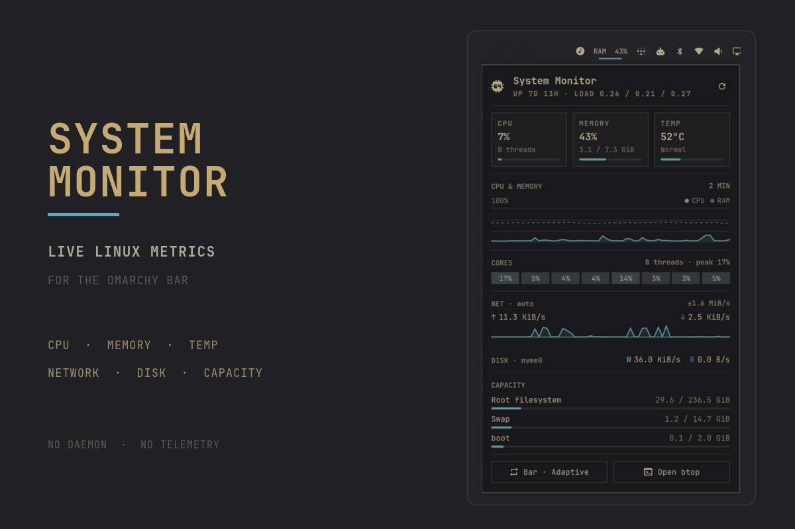
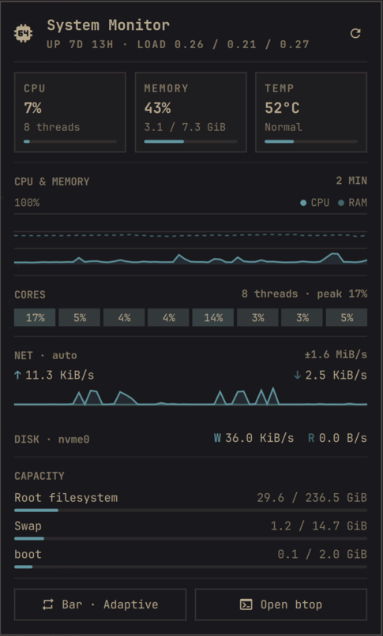

# System Monitor (Omaxian port)

A low-overhead dashboard for the Omaxian bar. Reads Linux metrics from `/proc`
and `/sys` — no background daemon or telemetry. Port of
[Harshith292002/omarchy-system-monitor](https://github.com/Harshith292002/omarchy-system-monitor)
(upstream commit `60baf04`, plugin version `1.2.0`).

Plugin id: `harshith.system-monitor` (unchanged). Optional — not installed by
`./deploy.sh`. See [`../README.md`](../README.md) for the catalog install
pattern.



## Omaxian deltas

`omarchy-plugin-check` reports **compatible** (no Wayland / Hyprland / systemd
couplings). One runtime delta:

| Upstream (Omarchy) | This port |
| --- | --- |
| Middle-click / `B` → `omarchy-launch-or-focus-tui btop` | `$OMARCHY_PATH/shell/scripts/sysmon.sh` (i3 float → btop / htop) |
| Docs: `omarchy plugin add` / `omarchy restart shell` | Local rsync install; logout/login after QML edits |

`Panel.qml` already uses `KeyboardPanel`. Metrics stay on `/proc` + `/sys` + `df`.

## Highlights

- Adaptive bar widget that can show CPU, memory, GPU, or both
- Expandable dashboard for CPU, RAM, temperature, load, and uptime
- GPU utilization, temperature, and VRAM, with per-sensor vendor fallbacks
- Two-minute CPU, memory, and GPU history with per-core utilization
- Mirrored network throughput history on a shared scale
- Automatic disk discovery with live read and write rates
- Root, swap, and every mounted local disk in one capacity section
- Configurable refresh intervals and warning thresholds

<p align="center">
  
</p>

## Dependencies

`bash` and `df` (standard). Optional: `btop` (or `htop` via `sysmon.sh`) for
middle-click / `B`.

## Install

From the Omaxian repo root:

```bash
PLUGIN=community-plugins/harshith.system-monitor
ID=$(jq -r .id "$PLUGIN/manifest.json")

omarchy-plugin-check "$PLUGIN"
omarchy-plugin-validate "$PLUGIN"

mkdir -p ~/.config/omarchy/plugins
rsync -a --delete -- "$PLUGIN/" "$HOME/.config/omarchy/plugins/$ID/"

omarchy-shell shell rescanPlugins
omarchy-plugin-enable "$ID"
```

### Update

```bash
omarchy-plugin-update "$ID" --from "$PLUGIN"
```

### Remove

```bash
omarchy-plugin-remove harshith.system-monitor
```

## Use

| Action | Result |
| --- | --- |
| Left-click | Open or close the dashboard |
| Right-click | Cycle `Adaptive` → `CPU` → `Memory` → `Both` → `Icon` (`GPU` is added when a card publishes utilization) |
| Middle-click | Open `btop` (via `sysmon.sh`) |
| `R` while open | Refresh metrics now |
| `B` while open | Open `btop` |

Configure under **Setup → Plugins → System Monitor** (bar mode, refresh
intervals, warning/critical thresholds, network interface).

## Metrics

| Area | Source |
| --- | --- |
| CPU, per-core load, and uptime | `/proc/stat`, `/proc/loadavg`, `/proc/uptime` |
| Memory and swap | `/proc/meminfo` |
| Network throughput | `/proc/net/route`, `/proc/net/dev` |
| Disk throughput | `/proc/diskstats` and `/sys/class/block` |
| CPU temperature | `/sys/class/hwmon` (`coretemp`, `k10temp`, or `zenpower`) |
| GPU load, temperature, and VRAM | `/sys/class/drm/card*/device` |
| Filesystem capacity | `df -P -k -l -T` |

NVIDIA proprietary cards are unsupported (no sysfs hwmon without spawning
`nvidia-smi` every sample). See upstream README for the per-driver matrix.

## Development

```bash
omarchy-plugin-check .
omarchy-plugin-validate .
node --test tests/model.test.js
bash tests/discovery.test.sh
```

After QML edits: re-rsync into `~/.config/omarchy/plugins/…`, then **log out /
log in** — do not run `omarchy-restart-shell` from an agent session.

## License

[MIT](LICENSE) © 2026 Harshith Chennupati.
