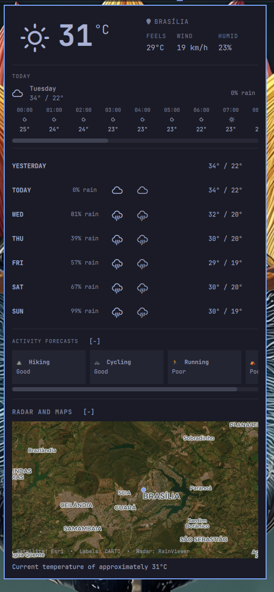
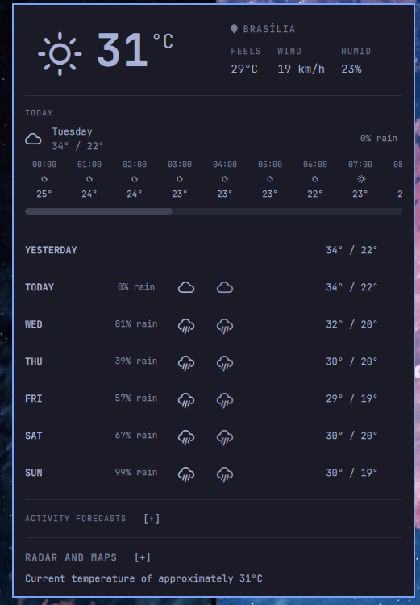
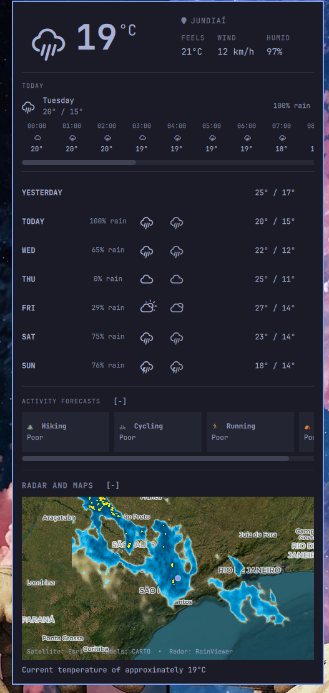

# Better Weather (Omaxian port)

Weather pill with a detail popup for the Omaxian bar. Catalog copy of
[guiestrela/weather](https://github.com/guiestrela/weather)
(upstream commit `232afb3`).

Plugin id: `io.github.guiestrela.weather` (unchanged). Optional — not installed
by `./deploy.sh`. See [`../README.md`](../README.md).

## Omaxian deltas

`omarchy-plugin-check` reports **compatible** with no code transforms.
`BarWidget.qml` / `Panel.qml` already use `KeyboardPanel` and
`omarchy-notification-send`; location writes go through
`omarchy-weather-location` (shipped with Omaxian); network I/O is via the
bundled `weather-helper.py` + `curl`.

Docs below use Omaxian install paths and **i3** binds instead of Hyprland /
`omarchy restart shell`.

## Preview

### Metric units



### Imperial units



### Detailed panel view



## Features

- Current temperature and weather icon.
- Feels-like temperature, wind speed, and humidity.
- Forecast for the next 5 days, including yesterday and today.
- Detailed forecast for the current day, including high, low, and rain probability.
- Hourly forecast for the current day with a draggable horizontal scrollbar.
- Activity forecasts for hiking, cycling, running, and camping.
- Live weather radar centered on the configured location.
- Satellite imagery with CARTO city labels, roads, and map outlines under the radar.
- Search for and change the location from the panel.
- Automatic location detection when no city is configured.
- Metric and imperial units; configurable refresh interval.

## Dependencies

`curl`, `/usr/bin/python3`, Nerd Font glyphs for weather symbols, a running
`omarchy-shell`, and `omarchy-weather-location` / `omarchy-notification-send`
(from `$OMARCHY_PATH/bin`).

## Install

From the Omaxian repo root:

```bash
PLUGIN=community-plugins/io.github.guiestrela.weather
ID=$(jq -r .id "$PLUGIN/manifest.json")

omarchy-plugin-check "$PLUGIN"
omarchy-plugin-validate "$PLUGIN"

mkdir -p ~/.config/omarchy/plugins
rsync -a --delete -- "$PLUGIN/" "$HOME/.config/omarchy/plugins/$ID/"

omarchy-shell shell rescanPlugins
omarchy-plugin-enable "$ID" --section center
```

### Replacing the built-in weather widget

Omaxian ships `omarchy.weather`. Disable it so only this pill remains:

```bash
omarchy-plugin-disable omarchy.weather
```

(Or remove `omarchy.weather` from the bar layout in Settings → Bar /
`~/.config/omarchy/shell.json`.)

After enabling a new plugin, **log out and back in** so Quickshell picks up
the tree cleanly (do not run `omarchy-restart-shell` from an agent session).

i3 keybind example:

```
bindsym $mod+Ctrl+w exec --no-startup-id omarchy-shell shell toggle io.github.guiestrela.weather
```

## Usage

- Left-click: open or close the panel.
- Middle-click: refresh the weather data.
- Right-click: send a weather summary notification.
- In the panel, click the city name to search for another location.

Open-Meteo supplies daily forecasts; wttr.in supplies current conditions and
acts as a fallback. Radar / satellite tiles come from RainViewer, Esri World
Imagery, and CARTO.

## Settings

In `~/.config/omarchy/shell.json`, on the plugin's entry:

| Key | Default | Meaning |
| --- | ------- | ------- |
| `unit` | `metric` | `metric` (°C) or `imperial` (°F) |
| `refreshMinutes` | `15` | Refresh interval in minutes (1–120) |

Change them in Settings → Bar (widget settings), or edit the plugin entry in
`~/.config/omarchy/shell.json`.

Location is stored at `~/.local/state/omarchy/settings/weather.json`
(managed by `omarchy-weather-location`). Panel expand state is at
`~/.local/state/omarchy/settings/weather-panel.json`.

## Privacy and network access

No account or API key. When a location is set, its name and/or coordinates go
to Open-Meteo and wttr.in for weather (HTTPS). RainViewer metadata is no longer
fetched into the shell; the panel opens RainViewer in the browser when you ask.
With no location configured, wttr.in is used for IP-based detection. No
credentials are stored.

## Remove

```bash
omarchy-plugin-remove io.github.guiestrela.weather
# optional — shared with stock omarchy.weather location:
# rm -f ~/.local/state/omarchy/settings/weather.json
# rm -f ~/.local/state/omarchy/settings/weather-panel.json
```

## Licence

MIT — see [LICENSE](LICENSE). Upstream copyright Guiestrela.

Radar imagery is from [RainViewer](https://www.rainviewer.com/) for personal,
educational, and small community use.
