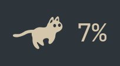
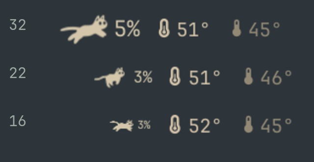

# Running Cat (Omaxian port)

A cat that runs along the Omaxian bar at a speed set by CPU load — it strolls
when the machine is quiet, sprints when it is busy, and sleeps when it is idle.

Catalog copy of [kaiizu/runningcat](https://github.com/kaiizu/runningcat)
(upstream commit `6314600`).

Plugin id: `io.github.kaiizu.runcat` (unchanged). Optional — not installed by
`./deploy.sh`. See [`../README.md`](../README.md).



## Omaxian deltas

`omarchy-plugin-check` reports **compatible** (no Wayland / Hyprland / systemd
couplings). Runtime deltas vs upstream:

| Upstream (Omarchy) | This port |
| --- | --- |
| Left-click `omarchy-launch-or-focus-tui btop` | `$OMARCHY_PATH/shell/scripts/sysmon.sh` (i3 float → btop / htop) |
| Fallback settings write via `omarchy bar set` | `omarchy-shell shell setBarWidget` (primary path is still `updateEntryInline`) |
| Docs: `omarchy plugin add` / Hyprland reload | Local rsync install; logout/login after QML edits |

Also: `textFormat: Text.PlainText` on the percentage label, and tooltip markup
stripped before handoff to `WidgetButton`.

## Highlights

- **Speed follows load.** One full run cycle takes `busyCycleMs` at 100% CPU and
  `idleCycleMs` at 0%, easing between the two.
- **Sleeps when idle.** Below `idleThreshold` the running frames give way to a
  sleeping cat with Z's.
- **Follows the theme.** Monochrome SVGs tinted with the bar foreground.
- **Configurable.** Knobs in `shell.json`; right-click, scroll, and IPC work
  from the widget.

## In the bar



Scroll to resize, right click to cycle `cat` → `cat + %` → `%`, left click to
open btop (or htop).

## Dependencies

A running `omarchy-shell`, Linux `/proc/stat`, and Qt Quick Effects (for sprite
tint). Optional: `btop` or `htop` for the default left-click action.

## Install

From the Omaxian repo root:

```bash
PLUGIN=community-plugins/io.github.kaiizu.runcat
ID=$(jq -r .id "$PLUGIN/manifest.json")

omarchy-plugin-check "$PLUGIN"
omarchy-plugin-validate "$PLUGIN"

mkdir -p ~/.config/omarchy/plugins
rsync -a --delete -- "$PLUGIN/" "$HOME/.config/omarchy/plugins/$ID/"

omarchy-shell shell rescanPlugins
omarchy-plugin-enable "$ID"   # default section: right
```

### Update

```bash
omarchy-plugin-update "$ID" --from "$PLUGIN"
```

See [`../README.md`](../README.md#update).

### Remove

```bash
omarchy-plugin-remove io.github.kaiizu.runcat
```

No residual state beyond whatever you put in `~/.config/omarchy/shell.json` for
this widget entry.

## Settings

Widget gestures (scroll / right-click) persist through the shell. From a
terminal, with the shell running:

```bash
omarchy-shell shell setBarWidget io.github.kaiizu.runcat display '"both"' '{}'
omarchy-shell shell setBarWidget io.github.kaiizu.runcat size '26' '{}'
omarchy-shell shell setBarWidget io.github.kaiizu.runcat idleThreshold '10' '{}'
```

Or edit the plugin entry under `bar.layout` in `~/.config/omarchy/shell.json`
(Settings → Bar also works).

| key | default | what it does |
|-----|---------|--------------|
| `interval` | `2` | Seconds between CPU samples. Reads `/proc/stat` directly. |
| `busyCycleMs` | `250` | Time for one full run cycle at 100% CPU. |
| `idleCycleMs` | `1100` | Time for one full cycle at 0% CPU. |
| `curve` | `2` | Easing exponent (`2` matches RunCat). |
| `smooth` | `true` | Ease speed toward each new reading. |
| `smoothMs` | `500` | Smoothing time constant (ms). |
| `idleThreshold` | `0` | Sleep at or below this CPU %. |
| `invertSpeed` | `false` | Run faster when idle. |
| `display` | `cat` | `cat`, `both`, or `percent`. |
| `size` | `22` | Sprite box in px (8–32). |
| `fontRatio` | `0.45` | Percentage size as a fraction of the sprite box. |
| `fontSize` | `0` | `0` follows `fontRatio`; otherwise pins the number. |
| `spriteColor` | `""` | Empty follows bar foreground; `#rrggbb` fixes the tint. |
| `clickCommand` | sysmon helper | Left-click command; empty disables it. |
| `cpuCommand` | `""` | Command that prints a CPU %; empty reads `/proc/stat`. |
| `framesDir` | `""` | Custom running frames (`0.svg`, …). |
| `idleFramesDir` | `""` | Custom sleeping frames. |

### Controls

| input | action |
|---|---|
| left click | run `clickCommand` (sysmon / btop by default) |
| right click | cycle `cat` → `cat + %` → `%` |
| scroll | resize the cat; percentage follows |
| middle click | resample CPU now |
| hover | tooltip with CPU % and controls |

### IPC

```bash
omarchy-shell io.github.kaiizu.runcat status
omarchy-shell io.github.kaiizu.runcat refresh
omarchy-shell io.github.kaiizu.runcat cycleDisplay
omarchy-shell io.github.kaiizu.runcat sizeUp
omarchy-shell io.github.kaiizu.runcat sizeDown
```

## Custom sprites

```bash
omarchy-shell shell setBarWidget io.github.kaiizu.runcat framesDir "\"$HOME/Pictures/cats\"" '{}'
omarchy-shell shell setBarWidget io.github.kaiizu.runcat idleFramesDir "\"$HOME/Pictures/cats/sleeping\"" '{}'
```

## Development

`Model.js` is free of QML imports; `npm test` (or
`node --test tests/model.test.mjs`) runs its Node tests.

```bash
PLUGIN=community-plugins/io.github.kaiizu.runcat
ID=$(jq -r .id "$PLUGIN/manifest.json")
rsync -a --delete -- "$PLUGIN/" "$HOME/.config/omarchy/plugins/$ID/"
```

Do **not** run `omarchy-restart-shell` from an agent session. After QML edits,
`./deploy.sh` is unrelated (this tree is outside `omaxian/`); re-rsync the
plugin and **log out / log in** so Quickshell reloads the widget.

`tools/build-preview.sh` regenerates `preview.png` and `docs/demo.gif` (needs
`rsvg-convert` and ImageMagick).

## Credits and license

**The idea and the cat** are from [RunCat for macOS](https://github.com/Kyome22/menubar_runcat)
by Takuto Nakamura. Also related: [gnome-runcat](https://github.com/win0err/gnome-runcat)
and [CatWalk](https://store.kde.org/p/2137844/).

**The sprite frames** in `assets/` are gnome-runcat's symbolic SVG set under
GPL-3.0. Because the frames are GPL-3.0, this plugin is GPL-3.0 as well. See
`LICENSE` and `NOTICE.md`.
