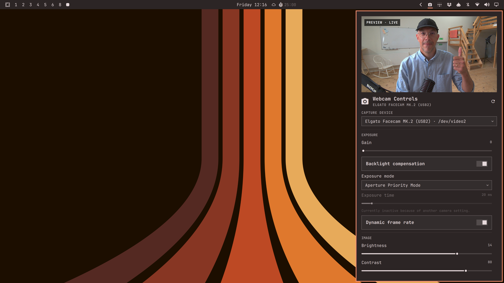

# Webcam Controls (Omaxian port)

Control any V4L2 webcam from the Omaxian bar with a live preview and
device-specific settings (exposure, focus, color, framing, and more).

Catalog copy of
[kristoferlund/omarchy-webcam](https://github.com/kristoferlund/omarchy-webcam)
(upstream commit `73332ce`).

Plugin id: `io.github.kristoferlund.webcam` (unchanged). Optional — not installed
by `./deploy.sh`. See [`../README.md`](../README.md).



## Omaxian deltas

`omarchy-plugin-check` reports **compatible** (no Wayland / Hyprland / systemd
couplings). Runtime notes vs upstream docs:

| Upstream (Omarchy) | This port |
| --- | --- |
| Arch packages `qt6-multimedia`, `v4l-utils` | Debian `qml6-module-qtmultimedia`, `v4l-utils` |
| `omarchy plugin add` / `omarchy bar move` | Local rsync install; `omarchy-plugin-enable --section …` / Settings → Bar |
| Docs: Hyprland / `omarchy restart shell` | Logout/login after QML edits |

QML, `Model.js`, and tests are unchanged. `webcamctl` uses a `#!/bin/bash`
shebang (Omaxian helper style); behaviour matches upstream.

## Features

- Live preview while the panel is open
- Capture-device picker
- Automatic detection of V4L2 capture devices
- Controls generated from each device's reported V4L2 controls
- Exposure, image, color, focus, framing, and device-specific groups
- Sliders, toggles, menus, action buttons, and raw value fields
- Read-only, inactive, grabbed, private, and compound controls
- Camera-reported default values
- Persistent device selection

Metadata-only `/dev/videoN` nodes are excluded. Multiple capture nodes from the
same physical device remain available because they may provide different
capabilities.

## Requirements

- Omaxian with third-party shell plugins enabled
- Qt Multimedia QML module (`qml6-module-qtmultimedia`)
- `v4l2-ctl` from `v4l-utils`
- A Linux V4L2 capture device

```bash
sudo apt install qml6-module-qtmultimedia v4l-utils
```

## Install

From the Omaxian repo root:

```bash
PLUGIN=community-plugins/io.github.kristoferlund.webcam
ID=$(jq -r .id "$PLUGIN/manifest.json")

omarchy-plugin-check "$PLUGIN"
omarchy-plugin-validate "$PLUGIN"

mkdir -p ~/.config/omarchy/plugins
rsync -a --delete -- "$PLUGIN/" "$HOME/.config/omarchy/plugins/$ID/"

omarchy-shell shell rescanPlugins
omarchy-plugin-enable "$ID"   # default section: right
# omarchy-plugin-enable "$ID" --section left
```

Move the widget later in Settings → Bar, or re-run enable with `--section left|center|right`.

### Update

```bash
omarchy-plugin-update "$ID" --from "$PLUGIN"
```

See [`../README.md`](../README.md#update).

### Remove

```bash
omarchy-plugin-remove io.github.kristoferlund.webcam
```

Device selection lives in this widget’s entry in `~/.config/omarchy/shell.json`
and is not deleted by remove.

## Usage

- Left-click the camera icon to open or close the panel.
- Middle-click the icon to refresh devices and settings.
- Select a camera from the device menu.
- Double-click a slider's displayed value to restore its reported default.
- Press Escape to close the panel.

The preview stays at the top of the panel. Closing the panel stops the preview
and releases the camera.

## Controls

| V4L2 control | Interface |
| --- | --- |
| Boolean or integer range `0..1` | Toggle |
| Menu or integer menu | Dropdown |
| Writable integer range | Slider |
| Button or write-only operation | Action button |
| Writable integer64, string, or bitmask | Value field |
| Read-only control | Value row |
| Compound or unsupported payload | Read-only value row |

Inactive and grabbed controls are disabled. Complex payloads are shown but
cannot be edited generically through `v4l2-ctl`.

## Device selection

The selected `/dev/videoN` path is stored in the widget's entry in
`~/.config/omarchy/shell.json`. Example:

```json
{
  "id": "io.github.kristoferlund.webcam",
  "device": "/dev/video2"
}
```

Device numbers can change after reconnecting hardware. Select the device again
if its path changes.

## Development

```bash
./webcamctl devices
./webcamctl state
./webcamctl state /dev/video2

omarchy-plugin-check .
omarchy-plugin-validate .
qmllint -I "$OMARCHY_PATH/shell" BarWidget.qml Panel.qml tests/tst_model.qml
qmltestrunner -input tests -import "$OMARCHY_PATH/shell" -o -,txt
bash -n webcamctl
```

## Security

Webcam Controls runs with user permissions inside `omarchy-shell`. `webcamctl`
restricts device arguments to `/dev/videoN`, validates control names and values,
and invokes `v4l2-ctl` without `eval`, `sh -c`, elevated privileges, network
access, or background services.

## License

MIT
