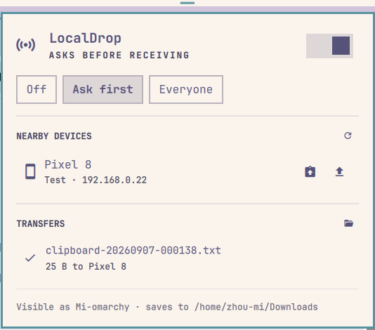

# LocalDrop (Omaxian port)

A bar widget for handing files to the machines around you: it shows what is
nearby, sends files or the clipboard to one with a click, and asks before it
accepts anything arriving.

Port of [metachow/omarchy-local-drop](https://github.com/metachow/omarchy-local-drop)
(upstream commit `0160786`). Speaks the **LocalSend v2 protocol** — iPhone,
Android, Mac, Windows, or another Linux box on the same Wi-Fi, no pairing.

Plugin id: `io.github.metachow.local-drop` (unchanged). Optional — not installed
by `./deploy.sh`. See [`../README.md`](../README.md) for the catalog install
pattern.



## Omaxian deltas

| Upstream (Omarchy / Wayland) | This port |
| ---------------------------- | --------- |
| Wayland paste helper for clipboard send | `xclip` (`TARGETS` + typed paste; X11 atoms mapped to text) |
| Session-manager wrapper around folder open | `/usr/bin/xdg-open` |
| Portal file chooser helper only | `local-drop-pick` → portal helper if present, else `zenity` |
| Group-dispatch hook runner | `omarchy-hook` if present, else the daemon runs `hooks/<name>.d/` itself |
| Group-dispatch DND toggle | `omarchy-toggle-notification-silencing` |
| Stock Omarchy deps only | Needs `xclip`, `zenity` (or portal file chooser), `openssl`, `xdg-user-dirs` |
| Multicast discovery only | Also unicast-scans local `/24`s (Wi-Fi APs often filter multicast) |
| Multiple daemons via `SO_REUSEPORT` | Singleton flock + quit leftover daemon on start |

QML uses `Panel` / `KeyboardPanel` already — no Hyprland or layer-shell imports.
`omarchy-plugin-check` should report **compatible** after these transforms.

## Using it

| Action | How |
|---|---|
| Open the panel | Click the LocalDrop icon in the bar |
| Send files | Click a device → the file chooser opens → pick files |
| Send the clipboard | The clipboard button on a device row (image if the clipboard holds one, otherwise text) |
| Accept an incoming transfer | `Accept` on the card (or press `a`) |
| Turn receiving on/off | The switch in the header, or right-click the bar icon |
| Look for devices again | The ↻ button, or middle-click the bar icon |
| Open the save folder | The folder button next to `TRANSFERS` |

Keys while the panel is open: `j`/`k` or arrows to move, `Enter` to send,
`a` accept, `x` decline, `v` send the clipboard to the highlighted device,
`r` re-announce, `o` open the download folder, `c` clear finished transfers,
`1`/`2`/`3` for Off / Ask first / Everyone.

## Receive modes

- **Off** — invisible to everyone, incoming transfers are refused.
- **Ask first** (default) — every transfer shows a card with the sender, the
  file names and the size. Nothing is written until you accept; the sender
  waits up to 60 seconds.
- **Everyone** — anything nearby can drop files straight into `~/Downloads`.

Files land in your XDG download directory, and an existing name is never
overwritten — a second `report.pdf` is saved as `report (1).pdf`.

## Parts

| File | Role |
|---|---|
| `local-dropd` | Python daemon: multicast discovery, HTTP receive server, sending |
| `local-drop-ctl` | Control CLI over the daemon's unix socket |
| `local-drop-pick` | File chooser wrapper (`omarchy-file-select` or `zenity`) |
| `Panel.qml` | Bar icon and popup |
| `Service.qml` | Runs the daemon, mirrors its state file into QML |
| `Model.js` | Formatting helpers and the bar glyphs |
| `hooks/` | Sample filing hooks for received files |
| `tests/` | Stand-ins for a second device — see [tests/README.md](tests/README.md) |

The shell starts and supervises `local-dropd`; it needs no init unit and no
root. State the panel reads: `$XDG_RUNTIME_DIR/omarchy-local-drop/state.json`.
Settings (device name, receive mode, identity): `~/.config/omarchy/local-drop.json`.

## Requirements

| Needs | For | Package |
|---|---|---|
| `python3` | daemon and CLI (stdlib only) | `python3` |
| `xclip` | reading the clipboard when you send it | `xclip` |
| `openssl` | client certificate encrypted peers ask for | `openssl` |
| `xdg-user-dir` | download directory | `xdg-user-dirs` |
| `zenity` *(or `omarchy-file-select`)* | file chooser | `zenity` |
| `xdg-open` | opening the download folder | `xdg-utils` |
| `omarchy-notification-send` | desktop notifications | Omaxian |

```bash
sudo apt install python3 xclip openssl xdg-user-dirs zenity xdg-utils
```

## Install

From the Omaxian **repo root**. The path checks matter: an empty `PLUGIN`
makes `rsync` copy `/` into `~/.config/omarchy/plugins/`.

```bash
set -euo pipefail
PLUGIN=community-plugins/io.github.metachow.local-drop
[[ -f $PLUGIN/manifest.json ]] || { echo "missing $PLUGIN/manifest.json (cwd=$(pwd))" >&2; exit 1; }
ID=$(jq -r .id "$PLUGIN/manifest.json")
[[ -n $ID && $ID != null ]] || { echo "bad plugin id" >&2; exit 1; }

omarchy-plugin-check "$PLUGIN"
omarchy-plugin-validate "$PLUGIN"

mkdir -p ~/.config/omarchy/plugins
rsync -a --delete -- "$PLUGIN/" "$HOME/.config/omarchy/plugins/$ID/"

omarchy-shell shell rescanPlugins
omarchy-plugin-enable "$ID"
```

### Update

```bash
omarchy-plugin-update "$ID" --from "$PLUGIN"
```

See [`../README.md`](../README.md#update).

## From the terminal

```bash
cd ~/.config/omarchy/plugins/io.github.metachow.local-drop
./local-drop-ctl status                      # full state as JSON
./local-drop-ctl devices                     # what is nearby right now
./local-drop-ctl send <fingerprint> a.png    # fingerprints come from `devices`
./local-drop-ctl send-clipboard <fingerprint>
./local-drop-ctl mode ask                    # off | ask | auto
./local-drop-ctl alias "Zhou's Laptop"       # rename this machine
```

And through the shell's IPC:

```bash
omarchy-shell io.github.metachow.local-drop toggle
omarchy-shell io.github.metachow.local-drop accept
omarchy-shell io.github.metachow.local-drop mode auto
omarchy-shell io.github.metachow.local-drop send <fingerprint>       # opens the file chooser
omarchy-shell io.github.metachow.local-drop clipboard <fingerprint>
```

## Notes

- Port **53317**, TCP and UDP. If the LocalSend app is already running it owns
  that port; the panel says so, sending keeps working, and receiving takes over
  by itself within 15 seconds of the app closing.
- A peer that announces `https` — which is what the LocalSend mobile apps do by
  default — is talked to over TLS, and those peers ask for a client certificate
  during the handshake (they identify each other by certificate fingerprint,
  not by CA). A self-signed one is generated on first use at
  `~/.config/omarchy/local-drop-cert.pem` (0600, valid ten years) and presented
  on every outgoing connection; peer certificates are accepted without
  verification, which is what every LocalSend client does. This machine
  announces `http`, so peers reach it in the clear.
- Anything on the local network can talk to the receive server, so it treats
  every field as hostile: a session can only be cancelled by the device that
  opened it and only by naming its id, uploads are refused from any other
  address, the device table is capped and evicts the stalest entry, a transfer
  larger than the free space is refused outright, and no malformed packet can
  take down the discovery loop.
- Transfers are plain HTTP on the local network, like LocalSend's own default.
  `Ask first` is what keeps a stranger on the same café Wi-Fi from writing to
  your disk — leave it on there, or switch receiving off.
- Phones only announce themselves while their LocalSend send screen is open,
  so a device that has gone quiet for 90 seconds drops off the list.
- Many Wi-Fi routers filter multicast between clients, so LocalSend's
  `224.0.0.167` announcements never arrive. The ↻ button (and a background
  timer) also TCP-probes your local `/24` for port 53317 and picks up peers
  that way — same path as `./local-drop-ctl scan`.
- Incoming requests, completed transfers and failures all raise a desktop
  notification. Do-not-disturb swallows those silently — they still land in
  the notification history. Toggle it with
  `omarchy-toggle-notification-silencing`.
- A sent clipboard is written to `$XDG_RUNTIME_DIR/omarchy-local-drop/outgoing/`
  first; the session clears that directory, and so does a daemon restart.

## Filing what arrives

Every file that lands runs hooks under
`~/.config/omarchy/hooks/local-drop-received.d/` (and a single
`local-drop-received` script if present). The daemon prefers `omarchy-hook`
when that binary exists; otherwise it runs the directory itself.

```bash
mkdir -p ~/.config/omarchy/hooks/local-drop-received.d
cp hooks/sort-by-type ~/.config/omarchy/hooks/local-drop-received.d/
chmod +x ~/.config/omarchy/hooks/local-drop-received.d/sort-by-type
# optional: file-with-agent (needs `claude` on PATH)
```

`sort-by-type` reads the MIME type and moves images to Pictures, video to
Videos, audio to Music, documents to Documents, and leaves everything else in
place. Deterministic and free.

`file-with-agent` asks Claude Code where the file belongs — a PNG called
`scan-of-lease-agreement.png` goes to Documents rather than Pictures. It costs
one short Claude call per received file.

Neither hook ever overwrites: they use `mv -n`, so a name collision leaves the
new file where it landed.

**If you write your own, remember the file name came off the network.** It is
attacker-chosen text, and in the agent hook it goes into a prompt. That hook
therefore never uses the model's answer as a path — the answer only picks from
a fixed list of directories, and anything unrecognised means "leave it alone".
A hook that ran `mv "$FILE" "$ANSWER"` would let a sender choose where their
file lands by naming it cleverly.

## Remove

```bash
omarchy-plugin-disable io.github.metachow.local-drop
omarchy-plugin-remove io.github.metachow.local-drop
# optional leftover state:
rm -f ~/.config/omarchy/local-drop.json ~/.config/omarchy/local-drop-cert.pem
rm -rf ~/.config/omarchy/hooks/local-drop-received.d
```
