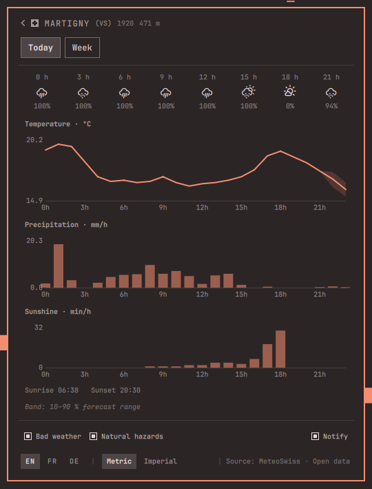
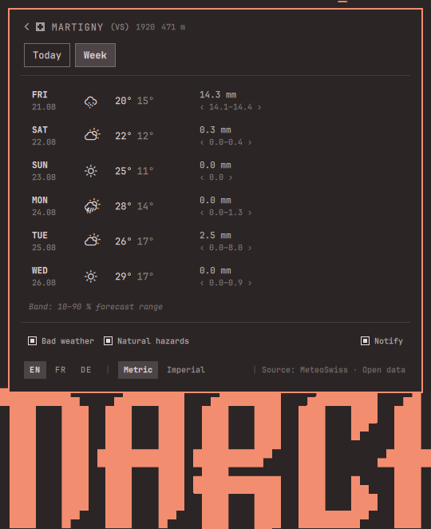

# Swiss Weather (Omaxian port)

MeteoSwiss weather in the Omaxian bar. Catalog copy of
[jmaeder/omarchy-swissweather](https://github.com/jmaeder/omarchy-swissweather)
(upstream commit `6406b7e`).

Plugin id: `jmaeder.swissweather` (unchanged). Optional — not installed by
`./deploy.sh`. See [`../README.md`](../README.md).

## Omaxian deltas

`omarchy-plugin-check` reports **compatible** with no code transforms.
`BarWidget.qml` / `Panel.qml` already use `KeyboardPanel` and
`omarchy-notification-send`; network policy in `lib/Net.js` is desktop-agnostic.

Docs below use Omaxian install paths and **i3** binds instead of Hyprland.

## Highlights

- **Measured, not only forecast.** Temperature, precipitation, wind and
  sunshine as an SMN station actually recorded them, stamped with the station
  and the minute, next to the 10–90 % forecast band for the same hour.
- **Warnings in force**, in MeteoSwiss's own two categories — *Bad weather*
  and *Natural hazards* — each named with its danger level and published
  colour, and each category switchable on its own.
- **Notifications** for new warnings of danger level 3 and above, off until
  you ask for them.
- **Three charts**: today by the hour, the week ahead, and 48 hours of wind
  with its gusts, all with their uncertainty bands.
- **Every Swiss postal code**, 4071 of them, searchable by name or number —
  offline, because the index ships with the plugin.
- **English, French or German**, metric or imperial. Unit conversion is
  arithmetic done on your machine.
- **One notification for every favourite** — a drop-in replacement for
  Omarchy's weather summary hotkey.

| Today | The week |
|---|---|
|  |  |

## Dependencies

`curl`, Nerd Font glyphs for weather symbols (Omaxian bar font), and a running
`omarchy-shell`. Optional: network to `data.geo.admin.ch`,
`app-prod-ws.meteoswiss-app.ch`, and (once, if `detectLocation` is on) `ipapi.co`.

## Install

From the Omaxian repo root:

```bash
PLUGIN=community-plugins/jmaeder.swissweather
ID=$(jq -r .id "$PLUGIN/manifest.json")

omarchy-plugin-check "$PLUGIN"
omarchy-plugin-validate "$PLUGIN"

mkdir -p ~/.config/omarchy/plugins
rsync -a --delete -- "$PLUGIN/" "$HOME/.config/omarchy/plugins/$ID/"

omarchy-shell shell rescanPlugins
omarchy-plugin-enable "$ID"   # default section: center
```

To place it next to the clock:

```bash
omarchy-plugin-enable jmaeder.swissweather --section center
```

(Or edit `~/.config/omarchy/shell.json` / Settings → Bar.)

### Replacing the built-in weather widget

Omaxian ships `omarchy.weather`. The two can run side by side — that is what
the small Swiss cross on this one's symbol is for — but one is usually enough.
Remove `omarchy.weather` from the bar layout in Settings → Bar, or drop it from
`bar.layout` in `~/.config/omarchy/shell.json`.

i3 keybind examples (put in `~/.config/i3/config.d/` or similar):

```
# Summary notification for every favourite (Omarchy's weather hotkey habit)
bindsym $mod+Ctrl+Mod1+w exec --no-startup-id omarchy-shell jmaeder.swissweather summary

# Toggle the panel
bindsym $mod+Ctrl+w exec --no-startup-id omarchy-shell jmaeder.swissweather toggle
```

## Controls

| Action | Result |
|---|---|
| Left click the bar item | Open / close the panel |
| Middle click | Refresh now |
| Right click | Next favourite town |
| Click any value | Open its chart |
| Enter | Town search |
| 1…9 | Jump to that favourite — or, in the charts, Today / Week |
| Esc | Back, then close |
| h | The keyboard shortcuts, over the panel |

## Settings

In `~/.config/omarchy/shell.json`, on the plugin's entry:

| Key | Default | Meaning |
|---|---|---|
| `showTemperature` | `false` | Show the temperature next to the bar symbol |
| `swissCross` | `true` | Badge the bar icon with a small Swiss cross |
| `refreshMinutes` | `15` | Poll interval, clamped to 5–180 minutes |
| `language` | *(locale)* | en, fr or de; the panel's own selector overrides it |
| `detectLocation` | `true` | Detect your region once, on first run |

## Data and privacy

Everything on screen is MeteoSwiss data, from `data.geo.admin.ch` and the
service behind the official MeteoSwiss app. Location detection is one request
to `ipapi.co`, at most once, and only if you leave `detectLocation` on. Those
three hosts are the only ones the plugin ever contacts; the list is enforced in
code and redirects are not followed. Town search runs against the bundled
index. State: `~/.local/state/omarchy/plugins/jmaeder.swissweather/`.

## Documentation

- [Manual](docs/manual.md)
- [Where the data comes from](docs/data-sources.md)
- [Privacy and security](docs/security.md)
- [Development](docs/development.md)

## Remove

```bash
omarchy-plugin-remove jmaeder.swissweather
rm -rf ~/.local/state/omarchy/plugins/jmaeder.swissweather   # optional
```

## Licence

MIT — see [LICENSE](LICENSE). Upstream copyright Jerome Maeder.

Weather data: **Source: MeteoSwiss**, used under the MeteoSwiss Open Data terms
of use. This plugin is not affiliated with or endorsed by MeteoSwiss.
