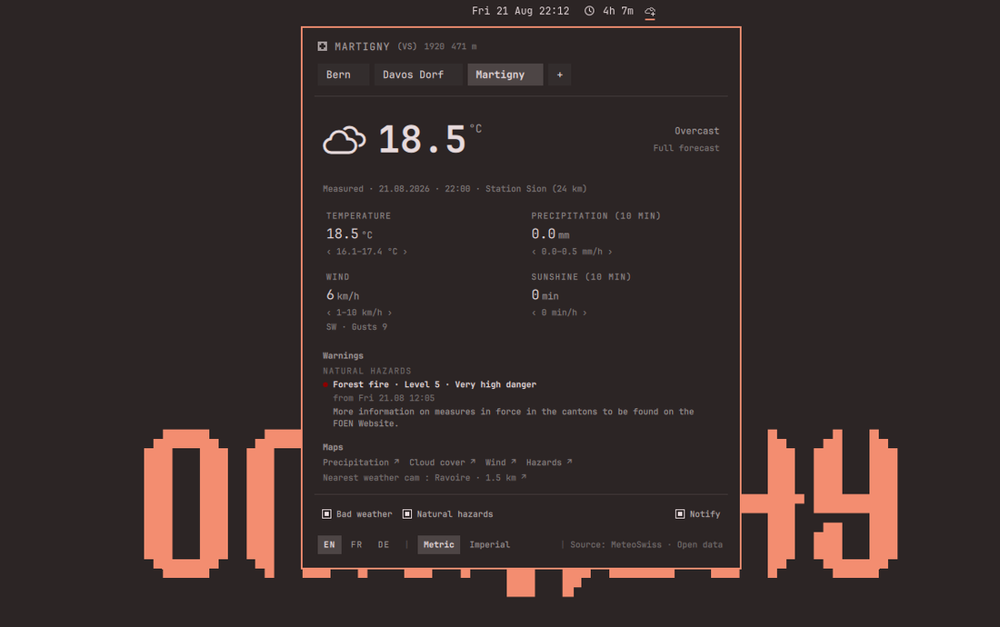

# Manual

[← README](../README.md)

## In the bar

The current weather symbol for the selected town, with a small Swiss cross laid
over it in the current theme's colours, and optionally the temperature. The
cross is what tells this widget apart from the built-in one if you run both.

The cross is drawn over the symbol's bottom-right corner, with hairline arms
that match the glyph's own stroke weight, and lives inside the button's optical
canvas rather than being anchored to the button. That placement is what keeps
it from touching the bar: the canvas is a fixed square inside a slot the bar
has already sized, so the bar measures the same height to the pixel with the
plugin enabled or disabled.

## In the panel



- As many favourite towns as you like, plus the detected one, as a row of
  chips. Removing every favourite returns the panel to its unconfigured state.
- Current conditions: the temperature, precipitation, wind and sunshine an SMN
  weather station actually recorded, stamped with the minute of the reading and
  the station it came from — alongside the 10–90 % forecast band for the same
  hour.
- MeteoSwiss warnings in force, grouped under **Bad weather** and **Natural
  hazards** — MeteoSwiss's own names for the two categories, which arrive mixed
  in the same feed. Each has its own tick, both on by default, and a third tick
  sends new warnings to the notification centre. Every warning is headed by
  what it is and how bad it is in MeteoSwiss's own words — *Forest fire · Level
  4 · High danger*, with the level's published colour as a dot — then when it
  applies and the labelled points MeteoSwiss wrote it as. A warning can run to
  several paragraphs, so the block is capped and scrolls in place: the whole
  text stays readable without pushing the rest of the panel off the bottom of
  the screen.
- Three charts, reached by clicking the reading they belong to — the
  temperature, precipitation and sunshine open the day, the wind opens the
  wind:
  - **Today** — hourly temperature with its uncertainty band, hourly
    precipitation with its 90 % whisker, hourly sunshine, three-hourly symbols
    with precipitation probability, sunrise and sunset.
  - **Week** — six days with symbol, high/low, and expected precipitation with
    its 10–90 % range.
  - **Wind** — 48 hours of wind speed with its quantile band, gusts as a dashed
    overlay, and a three-hourly direction strip.
- Links to MeteoSwiss's animated maps — precipitation, cloud cover, wind and
  hazards — in the panel's language, and to the nearest of the 35 MeteoSwiss
  weather cams, named with its distance. See
  [Where the data comes from](data-sources.md) for why these are links rather
  than pictures.
- A metric / imperial switch. Conversion is arithmetic done on the machine, so
  it costs no request and works offline.
- A language switch: EN / FR / DE. It covers everything, including the compass
  points — west is `W` in English and German but `O` in French, and east is `O`
  in German.
- A link beside the temperature to MeteoSwiss's own page for that town, in the
  panel's language.
- Clickable attribution: MeteoSwiss, and the Open Data documentation that
  specifies every parameter shown.

Search covers every Swiss postal code — by name (`geneve` finds *Genève*) or by
postal code (`8001`).

## Controls

| Action | Result |
|---|---|
| Left click the bar item | Open / close the panel |
| Middle click | Refresh now |
| Right click | Switch to the next favourite |
| `Enter` in the panel | Open town search |
| `1`…`9` | Switch to the favourite in that position, left to right |
| `1`, `2` in the charts | Today, Week |
| `Esc` | Back, then close |
| `h` | The keyboard shortcuts, over the panel |
| Click any value | Open the charts |
| Hover a chart | Read the value at that hour |

## IPC

```bash
omarchy-shell jmaeder.swissweather toggle
omarchy-shell jmaeder.swissweather refresh
omarchy-shell jmaeder.swissweather next     # next favourite
omarchy-shell jmaeder.swissweather summary  # notification, all favourites
omarchy-shell jmaeder.swissweather today    # open straight to a chart
omarchy-shell jmaeder.swissweather week
omarchy-shell jmaeder.swissweather wind
```

`summary` sends one notification with the current temperature, precipitation,
wind and sunshine for every favourite, up to eight of them:

```
Swiss Weather · 18:00
Davos Dorf (GR)  13.7 °C · 0.0 mm · 5 km/h · 0 min
Martigny (VS)    22.7 °C · 0.0 mm · 4 km/h · 0 min
Engelberg (OW)   19.8 °C · 0.4 mm · 5 km/h · 0 min
```

It costs no request. The measurements file is the whole SMN network in one
download, so every favourite's station is already in memory even though the
panel shows one at a time. Clicking the notification opens the panel.

Every value sits in a column of its own, as wide as its widest reading, so
three towns are read down rather than along; a town name too long for what is
left is cut with an ellipsis rather than allowed to wrap.

The popup itself is three lines tall — Omarchy's, not the plugin's — so a
fourth favourite and beyond are read in the notification centre rather than on
the popup. The lines carry no weather symbol for that reason: one symbol for a
list of towns could only ever be one town's, and the icon takes enough width
that each line wraps and two towns fill the three lines.

Handy under i3 (Omaxian):

```
bindsym $mod+Ctrl+w exec --no-startup-id omarchy-shell jmaeder.swissweather toggle
```

Upstream Hyprland equivalent used `bindd = SUPER CTRL, W, …`.

## Settings

Settings live on the plugin's entry in `~/.config/omarchy/shell.json`:

```json
{ "id": "jmaeder.swissweather", "showTemperature": true, "refreshMinutes": 15 }
```

| Key | Default | Meaning |
|---|---|---|
| `showTemperature` | `false` | Show the temperature next to the bar symbol |
| `swissCross` | `true` | Badge the bar icon with a small Swiss cross in the theme's colours |
| `refreshMinutes` | `15` | Poll interval, clamped to 5–180 minutes |
| `language` | *(locale)* | `en`, `fr` or `de`. The panel's own selector overrides this |
| `detectLocation` | `true` | Whether to detect your region once on first run (see below) |

Favourites, the selected town, the chosen language, the unit system, the
warning ticks and the notification setting are stored in
`~/.local/state/omarchy/plugins/jmaeder.swissweather/state.json`.

### Where it starts

Detection can be off, it can fail, and it can put you somewhere the plugin
cannot forecast. All three end the same way, on **Bern 3011** — the postal code
that covers the Federal Palace, 184 m from the building. Every point this
plugin can address is in Switzerland or Liechtenstein, so for an address
anywhere else there is no honest answer, and the seat of the Confederation is
the least arbitrary way to say *somewhere in Switzerland* while you pick your
own town.

| Situation | What happens |
|---|---|
| `detectLocation` is `false` | No request is made at all. Starts on Bern. |
| Detection fails — offline, blocked, timed out | Starts on Bern, and tries again next session rather than writing detection off for good. |
| Detected within 30 km of the border | Starts on the nearest Swiss town — Annemasse gets a Geneva one, Konstanz gets Kreuzlingen, Como gets Chiasso. |
| Detected further abroad | Starts on Bern and does not ask again. |
| Detected in Switzerland or Liechtenstein | Starts on the nearest of the 4071 towns. |

Two of those rows are about neighbours. Liechtenstein counts as home:
MeteoSwiss forecasts its towns and they are in the shipped index, Vaduz
included, so an address there gets its own town. And the border towns share
their weather with what is on the other side, so within 30 km the town across
the border describes the sky better than Bern does. Past that there is no such
town — Milan is 42 km from the nearest Swiss point and gets the default, which
is the honest answer rather than a confident wrong one.

Whatever it starts on, the first favourite you add replaces it, and removing
every favourite returns to this behaviour.

The language follows the same idea. A fresh install takes it from the system
locale — `de_CH` starts in German, `fr_CH` in French — and falls back to
English for any locale the plugin does not speak. The panel's own EN / FR / DE
selector overrides that from then on.

## Notifications

The third tick under the footer sends a new warning to Omarchy's notification
centre. It is **off** until you switch it on: showing a warning in a panel you
opened and pushing a popup onto your screen are not the same permission.

What it does and does not do:

- Only **danger level 3 and above** — marked, high, very high. Level 2 covers
  an ordinary rainy afternoon and level 1 a cantonal notice that can stand for
  a whole summer; neither is worth interrupting anyone.
- Only the **town on screen**. The plugin fetches that town's forecast and no
  others, so notifications cost no extra request.
- Only **once per warning**. A warning is identified by its town, hazard, level
  and period — not by its text, because MeteoSwiss re-words a standing warning
  as the forecast firms up, and being notified again over a comma is what makes
  people switch notifications off. The town is part of it because one regional
  warning covers many of them: without it, the second town under the same
  warning would be taken for one already announced. What has been announced is
  remembered in the state file, so a shell restart is silent.
- Switching the tick on marks whatever is in force as already seen. You are
  asking about the next warning, not about the one you are reading.
- At most three popups from one refresh; the panel is where a longer list
  belongs. The two category ticks still apply.
- Level 4 and 5 are sent as `critical`, so they come through Do Not Disturb.
  Clicking a notification opens the panel.

## Replacing the built-in weather widget

Omarchy ships its own weather widget, `omarchy.weather`. Nothing stops the two
running side by side — that is what the Swiss cross on this one's symbol is
for — but one of the two is usually enough:

```bash
omarchy plugin disable omarchy.weather
```

Both take a place in the bar rather than replacing each other, so disabling the
built-in one is a separate step from enabling this one, in either order. To put
it back:

```bash
omarchy plugin enable omarchy.weather
```

`omarchy plugin list` shows which of the two is enabled, and where every other
widget stands. Both commands edit the bar layout in
`~/.config/omarchy/shell.json` and take effect immediately — no restart.

One binding goes with it. Omarchy binds `SUPER + CTRL + ALT + W` to
`omarchy-notification-weather`, which toggles the built-in widget and therefore
does nothing once that widget is disabled. Point it here instead under i3:

```
bindsym $mod+Ctrl+Mod1+w exec --no-startup-id omarchy-shell jmaeder.swissweather summary
```

That keeps the habit and the key: a notification with every favourite's current
weather, without opening anything. Use `toggle` instead of `summary` to open
the panel the way the built-in widget opened its own.

## Removing the plugin

```bash
omarchy plugin remove jmaeder.swissweather
```

That deletes the plugin and its bar entry. Its settings live outside the plugin
folder, in `~/.local/state/omarchy/plugins/jmaeder.swissweather/`; delete that
directory too if you want the favourites and the chosen language gone as well.
