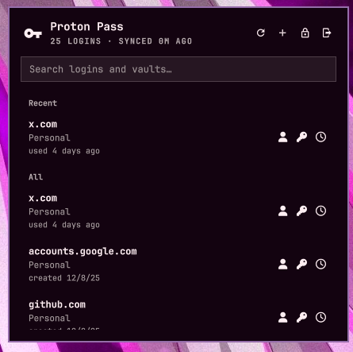

# Proton Pass (Omaxian port)

Keyboard-first Proton Pass login search and safe clipboard copy for the Omaxian
bar, via Proton's official [`pass-cli`](https://protonpass.github.io/pass-cli/).

Port of [josh2c/omarchy-protonpass](https://github.com/josh2c/omarchy-protonpass)
(upstream commit `0b6863e`, version 1.5.2).

Plugin id: `josh2c.protonpass` (unchanged). Optional — not installed by
`./deploy.sh`. See [`../README.md`](../README.md) for the catalog install
pattern.



It complements the official Proton Pass apps and CLI rather than replacing them,
and never displays a retrieved username, password, or TOTP code. The plugin
makes no network connections of its own; only Proton's official `pass-cli`
contacts Proton. [SECURITY.md](SECURITY.md) states every security claim plainly.

> [!IMPORTANT]
> Proton Pass CLI access requires a personal **Pass Plus** plan (or a bundle
> that includes it) or a business **Pass Professional** plan. Business **Pass
> Essentials is not eligible**. See Proton's
> [personal plan guide](https://proton.me/support/proton-pass-plans-explained)
> and [business plan comparison](https://proton.me/business/pass/pricing).

## Omaxian deltas

| Upstream (Omarchy / Wayland) | This port |
| ----------------------------- | --------- |
| Wayland sensitive clipboard CLI | `xclip` (fallback `xsel`); paste-once → `xclip -loops 1`; clear → empty write. No sensitive flag — auto-clear is the history mitigation |
| Doctor JSON `wlClipboard` | `clipboard` |
| `omarchy launch terminal …` | `omarchy-launch-floating-terminal-with-presentation` |
| Arch AUR / package-manager setup rows | `sudo apt install xclip` + Proton pass-cli docs |
| Nested-compositor QML snapshot / key-matrix CI | Omitted from this port (not useful under X11/i3) |
| Default `pass-cli` keyring backend | Helper and the `protonpass-cli` wrapper default to `PROTON_PASS_KEY_PROVIDER=fs` (official filesystem local-key store). Override with `keyring` / `env` if you prefer |

The panel already uses `KeyboardPanel` (no layer-shell), so no FloatingWindow /
i3 float rule is required.

Sign in / Unlock run `protonpass-cli` (not bare `pass-cli`) so a denied system
keyring cannot block the browser login flow.

Security contract is unchanged: **no secret ever enters QML**; field values go
`pass-cli` → helper → clipboard only.

## Requirements

Omaxian with third-party shell plugins enabled, and:

| Package / tool | For |
| --- | --- |
| Proton Pass CLI 2.3+ on `PATH` | vault / session / copy |
| Eligible Proton Pass plan (above) | CLI access |
| `xclip` (or `xsel`) | clipboard copy / clear |
| `jq`, `bash`, GNU coreutils | helper |

```bash
sudo apt install xclip jq
```

Install `pass-cli` from Proton's
[pass-cli documentation](https://protonpass.github.io/pass-cli/). On Arch the
community package is `proton-pass-cli-bin` (not the unrelated AUR project named
`pass-cli`).

## Install

From the Omaxian repo root:

```bash
PLUGIN=community-plugins/josh2c.protonpass
ID=$(jq -r .id "$PLUGIN/manifest.json")

omarchy-plugin-check "$PLUGIN"
omarchy-plugin-validate "$PLUGIN"

mkdir -p ~/.config/omarchy/plugins
rsync -a --delete -- "$PLUGIN/" "$HOME/.config/omarchy/plugins/$ID/"

omarchy-shell shell rescanPlugins
omarchy-plugin-enable "$ID"
```

Open the key icon in the bar. If signed out, choose **Sign in** — the plugin
launches `pass-cli login` in a floating terminal (Proton's browser auth flow).
Reopening the panel rechecks the session.

i3 keybind example (put in `~/.config/i3/config.d/` or similar, then
`i3-msg reload`):

```
bindsym $mod+Shift+p exec --no-startup-id omarchy-shell shell toggle josh2c.protonpass
```

### Update

```bash
omarchy-plugin-update "$ID" --from "$PLUGIN"
```

### Remove

```bash
omarchy-plugin-remove josh2c.protonpass
```

Leftovers (none are secrets): `~/.local/state/omarchy-protonpass/recents.json`,
`~/.local/state/...` clip hash under `$XDG_RUNTIME_DIR/omarchy-protonpass.clip`
while a clear timer is live. Removing the plugin does not uninstall Proton Pass
CLI or alter Proton's session files.

## Features

- Search login items across vaults by title or vault name.
- Copy username (email fallback), password, or TOTP with one keystroke.
- Create a login with a generated password from the panel.
- Recently used logins first; auto-clear clipboard after a delay; clear now.
- Lock / log out; sign in and unlock through Proton's CLI in a terminal.

Editing, deleting, sharing, attachments, custom-password creation, secret
display, and offline use are out of scope.

## Keyboard use

The panel opens with search focused. Row buttons intentionally omit visible
shortcut labels; this section is the sole shortcut reference.

### Global chords

| Chord | Action |
| --- | --- |
| `Enter` | Copy password |
| `Shift+Enter` | Copy username (email fallback) |
| `Ctrl+U` | Copy username (email fallback) |
| `Ctrl+P` | Copy password |
| `Ctrl+T` | Copy TOTP |
| `Ctrl+R` | Refresh the index |
| `Ctrl+L` | Lock the Proton Pass CLI session |
| `Ctrl+Shift+X` | Clear the plugin-owned clipboard value now |

### List and search keys

| Key | Context and action |
| --- | --- |
| Type | In search: filter by login title or vault name |
| `Down` or `Tab` | From search: enter list navigation |
| `j` / `k` or `Down` / `Up` | In list focus: move through results |
| `p` / `u` / `t` | In list focus: copy password / username / TOTP |
| `L` / `r` | In list focus: lock / refresh |
| `/` or another printable key | From list focus: return to search |
| `Esc` | Clear search, then close the panel |

Modifier chords can be remapped with the **Keyboard shortcuts** setting
(`chord:action` pairs). Actions: `copy-username`, `copy-password`, `copy-totp`,
`clear-clipboard`, `lock`, `logout`, `refresh`.

### Session locking

```bash
pass-cli session create-lock
```

Unlock launches `pass-cli session unlock` in a terminal.

## Settings

| Setting | Default | Range / behavior |
| --- | --- | --- |
| Clear clipboard after | 45 seconds | 0–300; `0` disables automatic clearing |
| Paste once | Off | `xclip -loops 1`; some apps read more than once and may fail to paste |
| Excluded vaults | Empty | Comma-separated, case-sensitive exact vault names |
| Keyboard shortcuts | Empty | Comma-separated `chord:action` overrides |
| Show recent items | On | Up to eight recently copied logins; off deletes the local store |

## Development

Offline tests (no Proton account):

```bash
tests/helper-test.sh
tests/security-test.sh
tests/manifest-test.sh
tests/source-contract-test.sh
tests/budget-test.sh
omarchy-plugin-check .
```

## License

MIT
