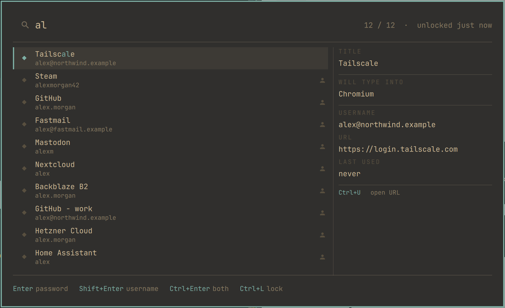

# KeePass Picker (Omaxian port)

Search a KeePass database from a keystroke and paste a credential into the
window you were just in. **Read-only and offline.** Port of
[mkelk/keepass-picker](https://github.com/mkelk/keepass-picker)
(upstream commit `659b31f`).

Plugin id: `mkelk.keepass-picker` (unchanged). Optional — not installed by
`./deploy.sh`. See [`../README.md`](../README.md) for the catalog install
pattern.



## Omaxian deltas

| Upstream (Omarchy / Hyprland) | This port |
| ----------------------------- | --------- |
| Full-screen layer-shell overlay | `Ui/CenteredModal` (T1; no picom black-out) |
| Compositor `activewindow` probe | `xdotool getactivewindow` (X11 window id) |
| Wayland sensitive clipboard + type | `xclip` + wipe on EXIT; `xdotool key` |
| Target captured while layer-shell is up | Target captured **before** the modal maps (X11 steals focus) |
| Hyprland bind / `windows.lua` pinentry rules | i3 bind example below |
| `omarchy-menu-file` only | Falls back to `find` + `omarchy-menu-select`, then `zenity` |

Security contract is unchanged: **no secret ever enters QML or crosses the
agent socket**; `keepassxc-cli` stays the vault boundary; paste goes stdin →
helper → clipboard → key chord → clear.

## Requirements

Omaxian with third-party shell plugins enabled, and:

| Package | For |
| --- | --- |
| `keepassxc` | `keepassxc-cli` |
| `pinentry-gnome3` or `pinentry-x11` / `pinentry-qt` | master-password prompt |
| `xclip` | clipboard paste path |
| `xdotool` | focus check + paste key |
| `python3` | the agent |
| `qt6ct` *(optional)* | themed pinentry palette |

```bash
sudo apt install keepassxc pinentry-gnome3 xclip xdotool python3
```

## Install

From the Omaxian repo root:

```bash
PLUGIN=community-plugins/mkelk.keepass-picker
ID=$(jq -r .id "$PLUGIN/manifest.json")

omarchy-plugin-check "$PLUGIN"
omarchy-plugin-validate "$PLUGIN"

mkdir -p ~/.config/omarchy/plugins
rsync -a --delete -- "$PLUGIN/" "$HOME/.config/omarchy/plugins/$ID/"

omarchy-shell shell rescanPlugins
omarchy-plugin-enable "$ID"
```

Then pick a `.kdbx` (path only — never a password):

```bash
~/.config/omarchy/plugins/mkelk.keepass-picker/bin/keepass-picker-ctl configure
```

i3 keybind example (put in `~/.config/i3/config.d/` or similar):

```
bindsym $mod+Shift+k exec --no-startup-id omarchy-shell shell toggle mkelk.keepass-picker
```

### Update

```bash
omarchy-plugin-update "$ID" --from "$PLUGIN"
```

### Remove

```bash
~/.config/omarchy/plugins/mkelk.keepass-picker/bin/keepass-picker-ctl lock
omarchy-plugin-remove mkelk.keepass-picker
```

Leftovers (none are secrets): `~/.config/keepass-picker/config.json`,
`~/.local/state/keepass-picker/usage.json`,
`~/.local/state/omarchy/keepass-picker.status.json`.

## Using it

| Key | |
| --- | --- |
| type | Search titles, usernames, URLs and notes |
| Enter | Paste the **password** into the window you came from |
| Shift+Enter | Paste the **username** |
| Ctrl+Enter | Paste **both** — username, Tab, password |
| ↑ ↓ / Tab Shift+Tab | Move through the results |
| Ctrl+U | Open the entry's URL (http/https only) |
| Ctrl+L | Lock the vault |
| Esc | Clear the query; again to dismiss |

Default paste key is `shift+Insert` (works in most apps). Terminals often want
`ctrl+shift+v` — set `"paste_key": "ctrl+shift+v"` in config.

## Configuration

`~/.config/keepass-picker/config.json` — database path and settings, never a
password. Same keys as upstream (`idle_timeout`, `search_notes`,
`allowed_fields`, `frecency`, `max_results`, `paste_key`, `fill_sequence`,
`fill_step_delay`, `pre_type_delay`, `search_paths`, `pinentry`, …).

## Development

```bash
./tests/run-all.sh
omarchy-plugin-check .
omarchy-plugin-validate .
```

Set `OMARCHY_PATH` to the shell tree (or deploy) so `tests/test_qml_tokens.py`
can resolve `Style` / `Color` singletons.

## Licence

MIT — see [LICENSE](LICENSE). Upstream copyright Morten Elk.
`bin/keepass-picker-insert` is derived from Omarchy's `omarchy-menu-emoji-insert`;
see [THIRD_PARTY_NOTICES.md](THIRD_PARTY_NOTICES.md).
