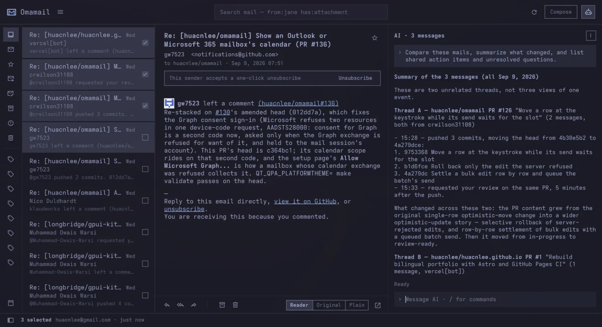
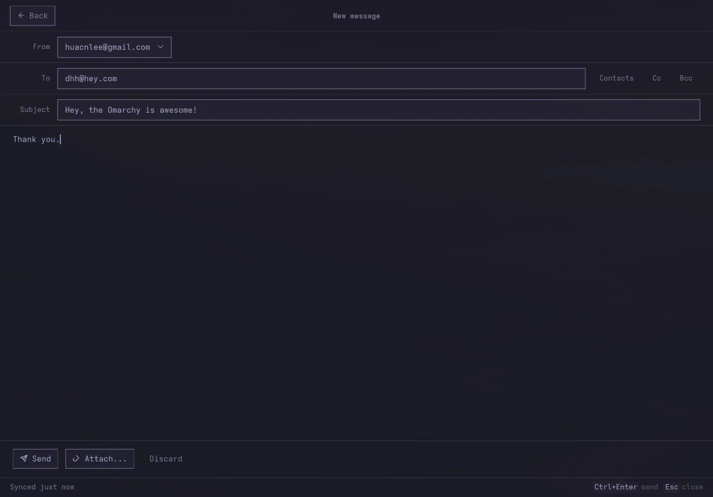
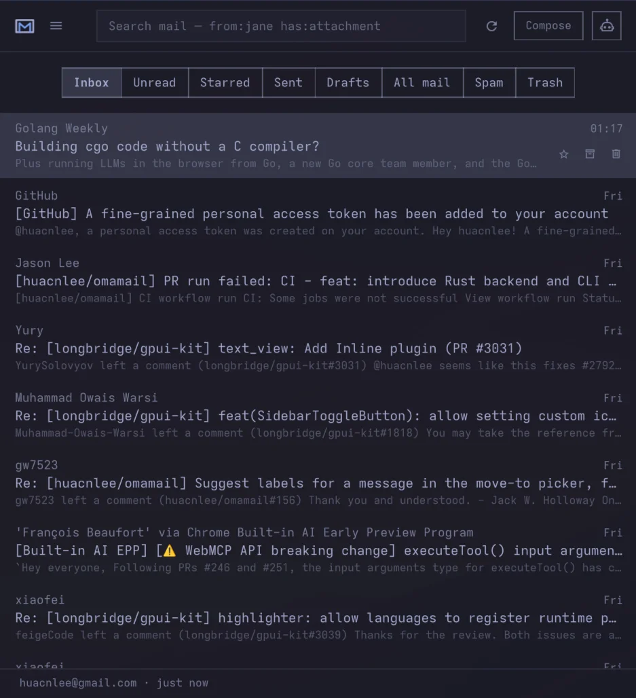

# Omamail (Omaxian port)

Email client for the Omaxian bar and shell. Port of
[huacnlee/omamail](https://github.com/huacnlee/omamail)
(upstream commit `9f624c4`, plugin version `0.10.5`).

Plugin id: `omamail` (unchanged). Optional — not installed by `./deploy.sh`.
See [`../README.md`](../README.md) for the catalog install pattern.

A native email and calendar app for Omarchy/Omaxian, with multiple accounts,
keyboard navigation, AI assistance and your desktop theme.

## Omaxian deltas

| Upstream (Omarchy) | This port |
| ------------------ | --------- |
| `Service.copyText` → Wayland clipboard CLI | Qt clipboard in `Service.copyText` |
| Wayland paste CLI then `xclip` for compose paste | `xclip` only |
| Hyprland bind example | i3 bind example below |
| Standalone Qt host under `app/` | Omitted (shell plugin only) |
| `omarchy-mise-install` for `hey` | [hey-cli](https://github.com/basecamp/hey-cli) / setup-page install line |
| `omarchy plugin add` / `make install` | rsync into `~/.config/omarchy/plugins/`; later `omarchy-plugin-update --from` |

`FloatingWindow`, `KeyboardPanel`, `secret-tool`, `curl`, and `notify-send` work
as on Omarchy. File attach uses `omarchy-file-select` when present, otherwise
`zenity`. Agent instruction files (`.agents/`, `AGENTS.md`) and the standalone Qt host
(`app/`) are omitted from this tree.

---



## Features

- **Multiple mailboxes:** Gmail, Outlook, HEY, JMAP and IMAP/SMTP, including Fastmail, iCloud and self-hosted servers.
- **Mail and calendar:** read, search, compose, manage attachments and respond to meeting invitations. Available actions depend on your provider.
- **Keyboard navigation:** `j`/`k` to move, `r` to reply, `c` to compose, `/` to search and `?` for all shortcuts.
- **AI assistance:** ask about selected messages and review suggested drafts using your Omarchy AI setup. See [AI assistance](docs/AGENT.md). Optional: suggest calendar events from mail (`suggestEvents` in Settings).
- **Desktop integration:** theme matching, unread counts, notifications, `mailto:` links and a compact layout for smaller windows.
- **Privacy controls:** credentials stored in the system keyring and remote images blocked until you choose to load them.

  

## Install the plugin

From the Omaxian repo root:

```bash
PLUGIN=community-plugins/omamail
ID=$(jq -r .id "$PLUGIN/manifest.json")

omarchy-plugin-check "$PLUGIN"
omarchy-plugin-validate "$PLUGIN"

mkdir -p ~/.config/omarchy/plugins
rsync -a --delete -- "$PLUGIN/" "$HOME/.config/omarchy/plugins/$ID/"

omarchy-shell shell rescanPlugins
# rescan is async; omarchy-plugin-enable waits briefly for the id to appear
omarchy-plugin-enable "$ID"
"$HOME/.config/omarchy/plugins/$ID/scripts/register-mailto.sh" \
  "$HOME/.config/omarchy/plugins/$ID" --claim-default
```

### Update

When this port changes in the repo, refresh the installed tree (keeps accounts
and enablement):

```bash
omarchy-plugin-check "$PLUGIN"
omarchy-plugin-validate "$PLUGIN"
omarchy-plugin-update "$ID" --from "$PLUGIN"
```

Git installs: `omarchy-plugin-update omamail`. See
[`../README.md`](../README.md#update).

Open Omamail and explicitly install its backend when prompted. Loading the
plugin never downloads a binary. The installer uses the exact `backend-version`
release for Linux x86_64 or aarch64 and keeps it at `runtime/bin/omamail` inside
the plugin. See [backend installation and releases](docs/BACKEND-RUNTIME.md).

Then click the envelope in the bar. To open it from the keyboard, add an i3
bind (e.g. in `~/.config/i3/config.d/`):

```
bindsym $mod+Shift+g exec --no-startup-id omarchy-shell shell toggle omamail '{}'
```

Requires a running `omarchy-shell`, the Rust backend, `secret-tool`, `xdg-open`,
`python3`, `curl`, and `xclip` for keyring, desktop integration, and compose
paste. Attach picker: `zenity` (or `omarchy-file-select` if you have it).

```bash
sudo apt install libsecret-tools xdg-utils python3 curl xclip zenity
```

## Add your mailbox

Choose a provider in Settings. Gmail needs a Google OAuth client; Outlook needs
a Microsoft app registration. HEY uses the official
[HEY CLI](https://github.com/basecamp/hey-cli) (install via their docs or
`curl -fsSL https://hey.com/install-cli | bash` — Omaxian does not ship
`omarchy-mise-install`). JMAP and IMAP usually use an app password or API token.

See [mailbox setup](docs/MAILBOXES.md) for provider instructions and limitations,
including Microsoft 365 and Proton Mail Bridge.

Press `?` in Omamail for the shortcut sheet, or see the [keyboard guide](docs/KEYS.md).

## Help and contributing

- [Backend installation, updates and recovery](docs/BACKEND-RUNTIME.md)
- [Contributing](CONTRIBUTING.md)
- Upstream: [huacnlee/omamail](https://github.com/huacnlee/omamail)

Omamail is an independent project and is not affiliated with Google, Microsoft or 37signals. Gmail, Outlook and HEY belong to their respective trademark owners.

Licensed under the [MIT License](LICENSE).
